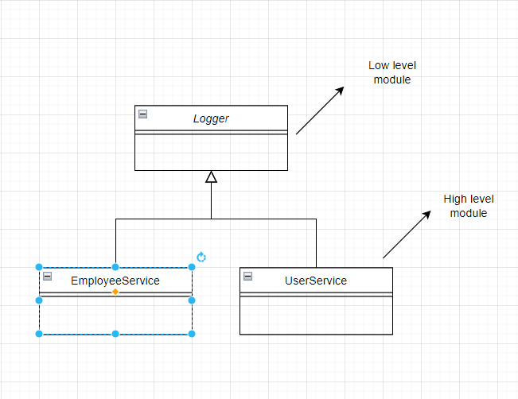

# **SOLID**

OOD (Object Oriented Design Principle) which is popular by Robert C. Martin.

## **Single Responsibility Principle (SRP):** 
---

>The Single Responsibility Principle (SRP) states that each software module should have one and only one reason to change.

>Gather together the things that change for the same reasons. Separate those things that change for different reasons.*

```typescript
class Product {
        public name: string;
        public description: string;
        public price: number;

        public purchase() {
            //implementation
        }

        public generatingInovoice() {
            //implementation
        }
    }
```

The principle statle that there should be only one responsiblity for each module. In the example of upper Class it violates the SRP for introducing **purchase()** and **generatingInovoice()** in a single class. They should not be togher in a module because purchase and generating Inovoice is two different things and two different reasons for changing. we can create two class for this two methods like the follwoing: 

```typescript
class Product {
        public name: string;
        public description: string;
        public price: number;
    }
    
    class ProductPurchase {
        public purchase(product: Product) {
            //implementation
        }
    }
    
    class InovoiceGenerator{
        public generateInovoice(product: Product) {
            ///implementation
        }
    }
```

That is example of class level module. If we write code for a task in a method that is not responsible for that, also violates the SRP. Here is an example of a method that violates the SRP: 

```typscript
createUser(){
    //code for creating a user
    //code for sending email to the user
}
```
creating user and sending email is two differnt task. There should be another mehtod for the seneding email who is only responsible for sending email. 

If we not maintain SRP in our code,  it can lead to a number of problems


## **Open Close Principle (OCP)**
---
Earlier Open/closed principle was defined by Bertrand Meyer in 1988:

> “Software entities (classes, modules, functions, etc.) should be open for extension, but closed for modification.”

Le's see the following example:

```typescript
   class Employee{
        name: string;
        type:EmployeeType.Intern;
    }

    enum EmployeeType{
        Trainee,
        JuniorSoftwareEngineer,
        SoftwareEngineer
    }

    class EmployeeSalaryCalculator{
        private base: number = 15000;

        calculateSalary(employee: Employee): number{
            else if(employee.type == EmployeeType.Trainee){
                return this.base * 1.67;
            }
            else if(employee.type == EmployeeType.JuniorSoftwareEngineer){
                return this.base * 3;
            }
            else if( employee.type == EmployeeType.SoftwareEngineer){
                return this.base * 5;
            }

            return 0;
        }
    }
```
In the above example we have Employee array which have employee type.Based on that type we calculate the salary of different type of employee. If more employee type added then we have to change code in enum and calculate salary method. If we change in code in the existing class or method in production it can create bug in our working code and we have to test all the module which use this method.Our code should close for modification. We should not modify our existing code unless we get bug in it. Lets see the below code example how we apply OCP in the previous code.

```typescript
class Employee {
        name: string;
        salaryCalculator: IEmployeeSalaryCalculator;

        constructor(name: string, calculator: IEmployeeSalaryCalculator) {
            this.name = name;
            this.salaryCalculator = calculator;
        }
    }

    interface IEmployeeSalaryCalculator {
        calculateSalary(base: number): number;
    }

    class TraineeSalaryCalculator implements IEmployeeSalaryCalculator{
        calculateSalary(base: number): number {
            return base * 1.67;
        }
    }

    class JuniorSoftwareEngineerSalaryCalculator implements IEmployeeSalaryCalculator{
        calculateSalary(base: number): number {
            return base * 3;
        }   
    }

    class SoftwareEngineer implements IEmployeeSalaryCalculator{
        calculateSalary(base: number): number {
            return base * 5;
        }
    }
```

We can create ```IEmployeeSalaryCalculator```  interface for salary calculation . We can create salary calculator classe for each type of employee and implement the interface to it. No, If we have to add new type of emplyee then we can easily create a class for this and implement the interface to it. No code will be modified. There will be no effect on the existing code for the new type. Our code in now open for extensin and we can extend our code according to our need.


## **Liskov Substitution Principle**
---
>The principle defines that objects of a superclass shall be replaceable/interchangeable with objects of its subclasses without breaking the application. 


Robert C. Martin summarizes it:

>Subtypes must be substitutable for their base types.

Barbara Liskov, defining it in 1988, provided a more mathematical definition:

>If for each object o1 of type S there is an object o2 of type T such that for all programs P defined in terms of T, the behavior of P is unchanged when o1 is substituted for o2 then S is a subtype of T.

```typescript
class Apple {
    public GetColor() {
        return "Red";
    }
}

class Orange implements Apple{
    public GetColor() {
        return "Orange";
    }
}
```


```typescript
apple: Apple = new Orange();
```

In the above example we can inherit Orange from apple. Compailer will not give error.But they are not interchangeable. If we assign Orange instance to Apple then from the GetColor method of apple instance, we will not get the correct behavior of Apple. Apple is not Orange Color. It will confused developer.If we have to inherit then we have to ensure that the parent class property that the child class override will behave same as parent class. Let's take a look at the following example:

```typescript
   interface IFruit{
         GetColor(): string;
    }

    class Apple implements IFruit{
        public GetColor() {
            return "Red";
        }
    }

    class Orange implements IFruit{
        public GetColor() {
            return "Orange";
        }
    }
```
``` typescript
fruit: IFruit = new Orange();
fruit: IFruit = new Apple();
```
If we implement IFruit To Apple or Orange. The IFruit instance is interchangable to Apple or Orange instance.The expected Fruit color can be red or orange or anything. So behaviour of the class is not changed. 


## **Interface Segregation Principle (ISP)**
---
>It is the SRP for Interface

>Clients should not be forced to implement any methods they don’t use. Rather than one fat interface, numerous little interfaces are preferred based on groups of methods with each interface serving one submodule.

Let's see the following example:

```typescript
   interface IPrinter{
        print(content: string): void;
        scan(): void;
        fax(): void;
    }

    class MultiFunctionPrinter implements IPrinter{
        print(content: string): void {
            //implementation
        }
        scan(): void {
            //implementation 
        }
        fax(): void {
            //implementation
        }
    }

    class AnaloguePrinter implements IPrinter{
        print(content: string): void {
            //implementation
        }
        scan(): void {
            throw new Error("Method not implemented.");
        }
        fax(): void {
            throw new Error("Method not implemented.");
        }
    }
```

In the above example we force Analogue priner to implement scan and fax functionality. But they have no functionality like these. And we force every type of printer to implement the functinality that they don't have. We can create separate interface for each of the funcionality. The solution of the problem are given below:

```typescript
interface IPrinter{
        print(content: string): void;
    }

    interface IFaxTask{
        fax(): void;
    }

    interface IScanner{
        scan(): void;
    }

    class MultiFunctionPrinter implements IPrinter, IScanner, IFaxTask{
        print(content: string): void {
            //implementation
        }
        scan(): void {
            //implementation 
        }
        fax(): void {
            //implementation
        }
    }

    class AnalogPrinter implements IPrinter{
        print(content: string): void {
            //implementation
        }
    }
```
Now we separate the interface for each of the functionality and do not force analogue type printer to implement the functuality that it doesn't have.


## **Dependency Inversion Principle**
---
>High-level modules should not depend on low-level modules. Both should depend on abstractions.Abstractions should not depend on details. Details should depend on abstractions.





Let's see below example: 

```typescript
class Logger {
        public logToConsole(message: string) {
            //implementation
        }
    }

    class EmployeeService { //higher level module
        createEmployee() {
            //creation employee
            let logger: Logger = new Logger(); //low level module
            logger.logToConsole("Employee creation completed");
        }
    }

    class UserService {
        createUser() {
            //creating user
            let logger: Logger = new Logger();
            logger.logToConsole("User creation completed");
        }
    }
```

Here High level module is the EmployeeService and UserService. They depend on Logger class which is low level module.If we want to change our logger then we have to modify every class or module which use it and also test it.It violates the OCP.And make code tightly coupled. We can create ILogger and Logger, EmployeeService and UserService will depend on it. Then our system will be loosely coupled.

>Loose coupling, where you have minimal interdependence between components or modules of a system, is a sign of a well-structured application.

Here is the solution:

```typescript
interface ILogger {
        log(message: string): void;
    }

    class ConsoleLogger implements ILogger {
        log(message: string): void {
            //implementation
        }
    }

    class EmailLogger implements ILogger {
        log(message: string): void {
            //implementation
        }
    }

    class EmployeeService {
        private _logger: ILogger;
        
        constructor(logger: ILogger) {
            this._logger = logger;
        }

        createEmployee() {
            //creating employee
            this._logger.log("Employee creation completed");
        }
    }

    class UserService {
        private _logger: ILogger;

        constructor(logger: ILogger) {
            this._logger = logger;
        }

        createUser() {
            //creating user
            this._logger.log("User creation completed");
        }
    }
```